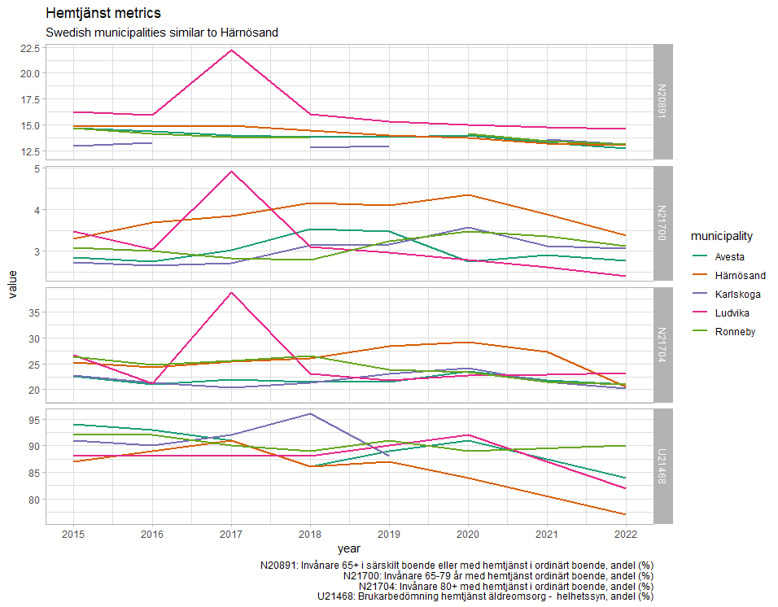

# Comparable municipalities

## From VR Proposal

Per the grant proposal, three comparable municipalities will be identified and used as controls.

>"Härnösand is the intervention municipality, with three other municipalities as controls. Based on information 
>from the Kolada database (Jul 30, 2024), Avesta, Ludvika, Ronneby and Karlskoga are most like Härnösand 
>when it comes to health care and social services for older adults. Two of those and one municipality of similar 
>size as Härnösand will be selected among the nine municipalities in Sweden affiliated with the AFCC network."

Referring to the WHO website for Age friendly cities and communities and the website Myndigheten för delaktighet, the following 9 municipalities are members of the AFCC network:

- Gävle, Göteborg, Hallstahammar, Stockholm, Uppsala, Kristianstad, Botkyrka, Upplands-Bro, Östersund

- Avesta, Ludvika, Ronneby and Karlskoga


https://extranet.who.int/agefriendlyworld/search-network/?_sft_countries=sweden
https://www.mfd.se/samhallsomraden/utformning-av-fysisk-miljo/aldersvanliga-stader-och-samhallen/

## Matching - from data found in Register-RELOC-AGE

Kolada's data is extensive and I would argue is a superior source to identify comparable municipalities. However, there are some metrics which could be useful, depending on the metrics desired. 

I have created a tool to identify comparable municipalities based on a few hand-chosen metrics.  Other metrics can be added - let me know and I can add them to the tool. It can be found here:

```{r echo=FALSE}
knitr::include_app("https://nickchristie.shinyapps.io/harnosand/",
  height = "600px")
```


## Matching - other ideas

The Härnösand Initiative specifies Kolada metrics in which the success (and funding) is dependent on.  The text below is from a Kommunstyrelsen meeting which defines the metrics.

The meeting notes may be found here:

https://harnosand.se/download/18.7c3b4d7718d6fe74b4fa6eac/1707215813865/Handlingar%20kommunstyrelsen%202024-02-13.pdf


>Invånare 65+ i särskilt boende eller med hemtjänst i ordinärt boende, andel (%)
>
>”Andelsmått” betyder det index i Kolada som benämns ”Invånare 65+ med hemtjänst i ordinärt boende, andel (%)”.
>
>”SÄBO-mått” betyder det index som i Kolada benämns ”Invånare 65+ i särskilda boendeformer, andel (%)”.
>
>”Kvalitetsmått” betyder det index som i Kolada benämns ”Brukarbedömning hemtjänst äldreomsorg - helhetssyn, andel (%)”.
>
>”Timmått” betyder det index i Kolada benämnt ”Beviljade antal hemtjänsttimmar per brukare och månad för timregistrerade hemtjänsttagare 65+ i ordinärt boende, timmar/hemtjänsttagare”.


I have yet to track down the exact Kolada data item for these metrics.  However, since the success of the Initiative will be judged by these metrics, it can be argued that municipalities with comparable values of these metrics would be superior candidates for comparisons.

Here are some similar metrics:

__N20891 - Antal personer 65+ år i särskilt boende eller med hemtjänst i ordinärt boende, dividerat med antal invånare 65+ år den 31/12.__ 

__N21700 - Antal personer 65-79 år med hemtjänst i ordinärt boende, dividerat med antal invånare 65-79 år den 31/12.__ 

__N21704 Antal personer 80+ år med hemtjänst i ordinärt boende, dividerat med antal invånare 80+ år den 31/12.__ 

__U21468 -Antal personer i åldrarna 65 år och äldre som uppgett "Mycket nöjd" eller "Ganska nöjd" på frågan "Hur nöjd eller missnöjd är du sammantaget med den hemtjänst du har?" __


If we identify the exact metric numbers from Kolada, we can pull the data and find comparables.  Or use their tool.  Here are these metrics plotted for some comparable municipalities:



