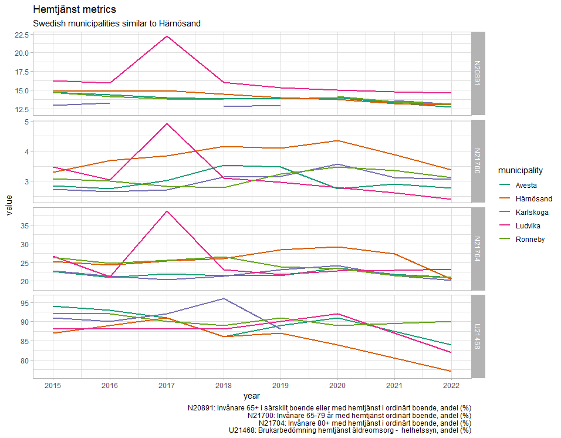

# Comparable municipalities

## From VR Proposal

Per the grant proposal, three comparable municipalities will be identified and used as controls.

>"Härnösand is the intervention municipality, with three other municipalities as controls. Based on information 
>from the Kolada database (Jul 30, 2024), Avesta, Ludvika, Ronneby and Karlskoga are most like Härnösand 
>when it comes to health care and social services for older adults. Two of those and one municipality of similar 
>size as Härnösand will be selected among the nine municipalities in Sweden affiliated with the AFCC network."

Referring to the WHO website for Age friendly cities and communities and the website Myndigheten för delaktighet, the following 9 municipalities are members of the AFCC network:

- Gävle, Göteborg, Hallstahammar, Stockholm, Uppsala, Kristianstad, Botkyrka, Upplands-Bro, Östersund

- Avesta, Ludvika, Ronneby and Karlskoga


https://extranet.who.int/agefriendlyworld/search-network/?_sft_countries=sweden
https://www.mfd.se/samhallsomraden/utformning-av-fysisk-miljo/aldersvanliga-stader-och-samhallen/

## Matching - from data found in Register-RELOC-AGE

Kolada's data is extensive and I would argue is a superior source to identify comparable municipalities. However, there are some metrics which could be useful, depending on the metrics desired. 

I have created a tool to identify comparable municipalities based on a few hand-chosen metrics.  Other metrics can be added - let me know and I can add them to the tool. It can be found below (may be slow to load), or accessed directly at https://nickchristie.shinyapps.io/harnosand/ :

```{r echo=FALSE}
knitr::include_app("https://nickchristie.shinyapps.io/harnosand/",
  height = "800px")
```


## Matching - other ideas

The Härnösand Initiative specifies Kolada metrics in which the success (and funding) is dependent on.  The text below is from a Kommunstyrelsen meeting which defines the metrics.

The meeting notes may be found here:

https://harnosand.se/download/18.7c3b4d7718d6fe74b4fa6eac/1707215813865/Handlingar%20kommunstyrelsen%202024-02-13.pdf


>Invånare 65+ i särskilt boende eller med hemtjänst i ordinärt boende, andel (%)
>
>”Andelsmått” betyder det index i Kolada som benämns ”Invånare 65+ med hemtjänst i ordinärt boende, andel (%)”.
>
>”SÄBO-mått” betyder det index som i Kolada benämns ”Invånare 65+ i särskilda boendeformer, andel (%)”.
>
>”Kvalitetsmått” betyder det index som i Kolada benämns ”Brukarbedömning hemtjänst äldreomsorg - helhetssyn, andel (%)”.
>
>”Timmått” betyder det index i Kolada benämnt ”Beviljade antal hemtjänsttimmar per brukare och månad för timregistrerade hemtjänsttagare 65+ i ordinärt boende, timmar/hemtjänsttagare”.


I have yet to track down the exact Kolada data item for these metrics.  However, since the success of the Initiative will be judged by these metrics, it can be argued that municipalities with comparable values of these metrics would be superior candidates for comparisons.

Here are some similar metrics:

__N20891 - Antal personer 65+ år i särskilt boende eller med hemtjänst i ordinärt boende, dividerat med antal invånare 65+ år den 31/12.__ 

__N21700 - Antal personer 65-79 år med hemtjänst i ordinärt boende, dividerat med antal invånare 65-79 år den 31/12.__ 

__N21704 Antal personer 80+ år med hemtjänst i ordinärt boende, dividerat med antal invånare 80+ år den 31/12.__ 

__U21468 -Antal personer i åldrarna 65 år och äldre som uppgett "Mycket nöjd" eller "Ganska nöjd" på frågan "Hur nöjd eller missnöjd är du sammantaget med den hemtjänst du har?" __


If we identify the exact metric numbers from Kolada, we can pull the data and find comparables.  Or use their tool.  Here are these metrics plotted for some comparable municipalities:




## Propensity score matching

A stronger method for the identification of comparable municipalities could be the use of propensity score matching.
PSM is a statistical technique used to reduce bias by matching units — in this case, municipalities — that have a similar likelihood of receiving the treatment (i.e., participating in the Härnösand program), based on observed characteristics.

In this approach, a logistic regression model is used to estimate each municipality’s __propensity score__ — the probability of receiving the intervention — using relevant pre-treatment covariates.
These may include variables from Kolada such as the ones above.

Once scores are estimated, the treated municipality (Härnösand) is matched to the most similar municipalities based on these scores. 

PSM complements the other approaches outlined above and offers a transparent, data-driven method for choosing comparison municipalities, which offers a structured methodological approach that may reduce subjectivity concerns.

### Criteria for Selecting Variables for Propensity Score Matching

- **Pre-treatment only**  
  Use variables measured *before* the intervention began. Avoid any indicators that could be influenced by the treatment itself.

- **Predictors of treatment assignment**  
  Include variables that are likely related to why a municipality received the intervention (e.g., existing care levels, demographics).

- **Predictors of the outcome**  
  Select variables that are also related to your outcome of interest (e.g., care home use), to control for potential confounding.

- **Not consequences of the treatment**  
  Do not include variables that might be affected by the treatment, as this can introduce bias.

- **Not perfectly collinear**  
  Avoid including variables that are highly correlated with each other, which can cause instability in the propensity score model.

- **Relevant to policy or selection context**  
  Include variables that reflect known criteria or conditions that may have influenced the decision to assign treatment.

- **Sufficiently variable across units**  
  Use variables that show meaningful variation across municipalities to improve the ability to distinguish treated from untreated units.
  

### Steps for Conducting Propensity Score Matching 

- **1. Define the treatment and units of analysis**  
  Clearly specify which municipality is treated and which are potential controls. The unit of analysis should be municipalities, since the treatment is assigned at that level.

- **2. Select relevant covariates**  
  Choose pre-treatment variables that are related to both the likelihood of receiving the treatment and the outcomes of interest. Use sources from Kolada to ensure transparency and comparability.

- **3. Estimate propensity scores**  
  Run a logistic regression model where the dependent variable is treatment status (1 = treated, 0 = control), and the independent variables are the selected covariates. The output is a predicted probability (propensity score) for each municipality.

- **4. Match treated and control units**  
  Match the treated municipality to one or more control municipalities with similar propensity scores. Use methods like nearest-neighbor matching, caliper matching, or Mahalanobis distance as appropriate.

- **5. Check covariate balance**  
  After matching, assess whether the treated and control municipalities are similar in their covariates. Use standardized mean differences, summary tables, or visual plots to check balance.

- **6. Conduct outcome analysis**  
  Compare outcomes between the treated and matched control municipalities. This can be done directly or using methods such as Difference-in-Differences if pre/post data is available.

- **7. Conduct sensitivity checks**  
  Test the robustness of your results using alternative matching methods or specifications. Consider exploring how unmeasured confounding might affect your findings.
  
### Example Code for Propensity Score Matching in Stata

```stata
* Step 1: Load your dataset
use "municipality_data.dta", clear

* Step 2: Create the treatment variable
* Example: 1 = Härnösand (treated), 0 = other municipalities
gen treated = (municipality == "Härnösand")

* Step 3: Estimate propensity scores using logistic regression
logit treated elderly_pct homecare_pct spending_per_capita satisfaction_score
predict pscore, pr

* Step 4: Perform nearest-neighbor matching
* Install psmatch2 if not already installed
ssc install psmatch2, replace

* Match using 1-to-3 nearest neighbors with a caliper
psmatch2 treated (pscore) (elderly_pct homecare_pct spending_per_capita satisfaction_score), neighbor(3) caliper(0.05) logit

* Step 5: Check covariate balance after matching
pstest elderly_pct homecare_pct spending_per_capita satisfaction_score, graph

* Step 6: Analyze the outcome (e.g., % in care homes) using matched data
* Outcome variable: carehome_pct

* Keep only matched observations
gen matched = _weight > 0
keep if matched

* Run weighted regression
reg carehome_pct treated [aw=_weight]

* Step 7 (optional): Use Difference-in-Differences if you have pre/post data
gen treated_post = treated * post
reg carehome_pct treated post treated_post [aw=_weight]
```


